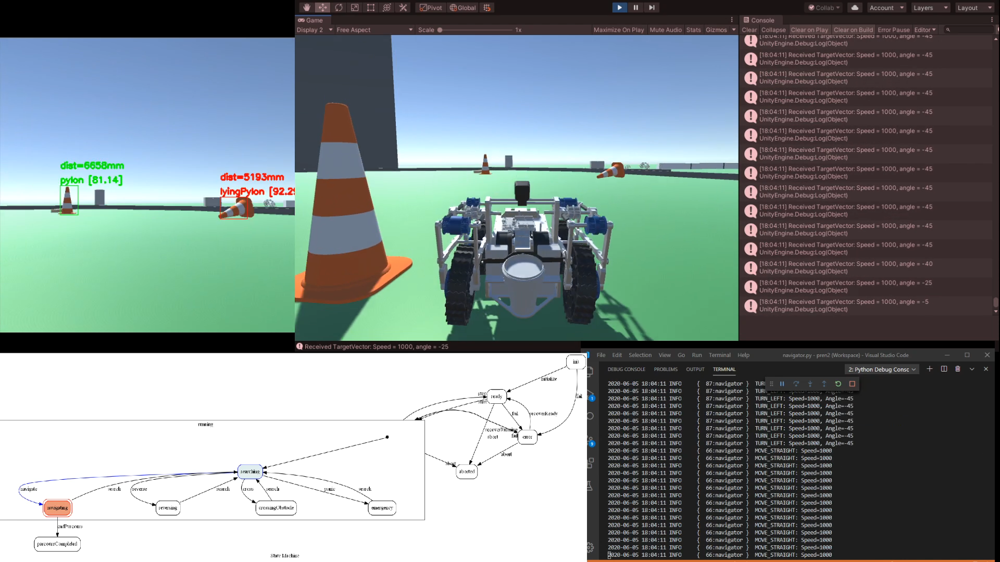

# PREN 2020 - Horwbot

This project contains the source code for the firmware, navigation and simulation of the robot "Horwbot" which was developed for the interdisciplinary module PREN at the Lucerne University of Applied Sciences and Arts.

## Project Goal

The goal of the project was to develop a device which can autonomously navigate a parcour consisting of traffic cones and various obstacles.

## Simulation

To test the navigation software, a Unity simulation was developed. The simulation listens for the commands of the navigation software and applies them directly to the simulated robot.

